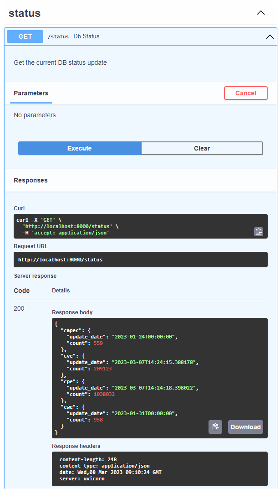
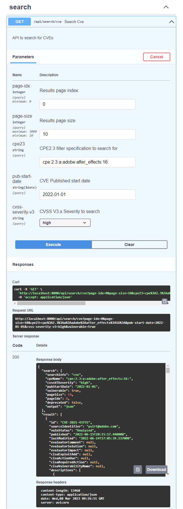
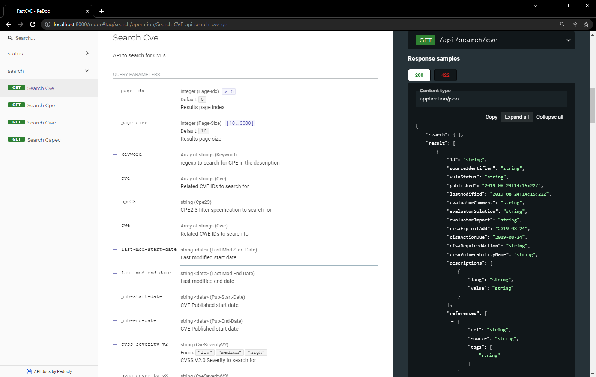

Copyright (c) 2020 to date, Binare Oy (license@binare.io) All rights reserved.

FastCVE - fast, rich and API-based search for CVE and more (CPE, CWE, CAPEC)
==================

`fastcve` is a command-line tool that allows you to search for vulnerabilities in the Common Vulnerabilities and Exposures (CVE) database. The tool provides an easy way to search for vulnerabilities and retrieve relevant information about them, including their descriptions, CVSS scores, and references to related security advisories.

`fastcve` is designed to be fast, lightweight, and easy to use. It provides a simple interface for querying the CVE database, allowing you to search for vulnerabilities based on vendors, products, and other criteria. The tool can be used by security professionals, system administrators, and developers to stay informed about known security vulnerabilities and to assess the risk of their systems and applications.

Overall, `fastcve` is a useful tool for anyone who is interested in keeping up-to-date with the latest information about security vulnerabilities and how they can be addressed.

Technical details
-----------------


Some key technical characteristics of `fastcve` tool:

1. **Docker containerization**: This tool would run as a Docker container, meaning it is packaged and runs as a standalone executable unit that includes all its dependencies. This makes it easy to deploy and run the tool on any system that supports Docker.

2. **Automatically creates the DB on first start**: The tool would automatically create the database when it is started for the first time, eliminating the need for manual setup.

3. **Automatically creates and upgrades the DB schema if needed**: The tool would automatically manage the database schema, creating it when necessary and upgrading it as needed to support new features or changes in the data structure.

3. **Capability to populate the DB using NVD APIs (2.0)**: The tool would have the capability to populate the database using APIs from the National Vulnerability Database (NVD), a comprehensive database of vulnerabilities that is maintained by the US National Institute of Standards and Technology.

4. **Automatically updates the DB schema for the latest changes from the previous update**: The tool would automatically update the database with the latest changes, new vulnerabilities, and new Common Platform Enumeration  (CPE) entries, ensuring that the database remains up-to-date and relevant.

The tool is a comprehensive solution for managing a database of vulnerabilities, Common Platform Enumeration (CPE) entries, designed to make it easy to keep the database up-to-date and relevant, and to simplify the process of querying the database for vulnerabilities and information about them. 

It was designed to be able to handle multiple query entries and maintain a high level of performance. It is optimized to be able to handle a large number of queries efficiently and quickly. The goal is to provide a fast and reliable solution for searching, maintaining and updating information about vulnerabilities and their corresponding CPE entries. The tool is also able to provide information about CWE (Common Weakness Enumerations) and CAPEC (Common Attack Pattern Enumerations and Classification)


Build
----------


In order to build the docker image you need to trigger:
```
docker compose build
```

this would create a new image named as `fastcve:latest`. In case a special tag is needed then export before hand ENV var `DOCKER_TAG=<your_tag>` to generate `fastcve:<your_tag>`


First Run
---------

Before starting the container for the first time several env variables has to be exported first:
```
export INP_ENV_NAME=<the env name from where settings to be read . i.e.:dev>
export POSTGRES_PASSWORD=<password for postgre DB user>
export FCDB_USER=<fastcve DB User Name>
export FCDB_PASS=<fastcve DB User Password>
```

To run the container:
```
docker compose up
```

Configuration parameters
------------------------

The docker container holds the relevant configuration files under `/fastcve/config/setenv`
This map would contain the following files:
- `config.ini` - contains app related config parameters
- `setenv_<${INP_ENV_NAME}>.ini` - contains parameters that are env dependent as per the `INP_ENV_NAME` env variable value. 

For an easy access and modification of the config files, mapping between HOST and container's folder `/fastcve/config/setenv` is recomended that can be specified in the `docker-compose.yml` file.

How To
------


- **Populate the CVE, CPE, CWE, and CAPEC data for the first time**:
```
docker exec fastcve load --data cve cpe cwe capec
```

- **Populate the CVE, and CPE data for the next times**:
```
docker exec fastcve load --data cve cpe
```

this will fetch the new/modified data for the period from the last data fetch (for a max of `n` days: parameter set in the config. NVD is allowing max 120 days period)

If there is a need to repopulate the DB for the CWE/CAPEC info, then `--full` and `--drop` options are available for the CWE/CAPEC info load command. `--full` will cause to ignore the fact the CWE/CAPEC data is already present and `--drop` will cause to drop any exiting CWE/CAPEC related data before processing the new downloaded data.

- search for the data: **get the CVEs details (JSON) for a list of CVE-IDs**
```
docker exec fastcve search --search-info cve --cve CVE-YEAR-ID1 CVE-YEAR-ID2
```

- search for the data: **search CVEs by the summary text**
```
docker exec fastcve search --search-info cve --keyword '(buffer overflow|memory corruption).*before.*2\.1[0-9]'
```
Above will search in the CVE text and return the details of those CVEs that would match the summary/description text with the specified keyword. It is possible to specify more than one keywords and each keyword can be specified in form of regexp pattern. If multiple keywords are specified, it would consider as AND condition between the keywords.

- search for the data: **get the CVEs IDs for a specific CPE**
```
docker exec fastcve search --search-info cve --cpe23 cpe:2.3:*:*:linux_kernel:2.6.32: --output id
```

above will return the list of CVE-IDs that are related to `linux_kernel` product for version 2.6.32.

To get the CVE details, request the output in JSON format: `--output json`. 

To get only those CVEs that were modified in the last `n` days, add the option `--days-back n` i.e. `--days-back 10` - only created/modified in the last **10** days

additional filters are available for the search in CVE DB:
```
--cvss-severity-v2 {low, medium, high}   # retrieve only those CVEs that has the severity as per CVSS score Version 2
--cvss-severity-v3 {low, medium, high, critical} # retrieve only those CVEs that has the severity as per CVSS score Version 3.x
--cvss-metrics-v2 CvssVector # CVSS V2.0 vector string to search for (default: None)
--cvss-metrics-v3 CvssVector # CVSS V3.x vector string to search for (default: None)
--cwe CWE [CWE ...]     # retrieve only those CVEs that are related to the specified list of CWE IDs
--pub-start-date    # retrieve only those CVEs that are published after the start date
--pub-end-date      # retrieve only those CVEs that are published before the end date
--last-mod-start-date # retrieve only those CVEs that are last modified after the start date
--last-mod-end-date   # retrieve only those CVEs that are last modified before the end date
```
- search for the data: **get the valid list of CPE names for a query on part/vendor/product/version etc**.

```
docker exec fastcve search --search-info cpe --cpe23 cpe:2.3:h:*:dl*:*: --output id
```

Above will search for all valid existing CPE 2.3 names that are of hardware type, for any vendor, product starts with `dl`*, and version is any

To see for the other options available for both `load` and `search` commands run these with `-h` option

```
docker exec fastcve search -h
docker exec fastcve load -h
```

The same search capabilities are exposed through the web interface as well. The web interface is exposed through port 8000 by default. Can be changed in the `docker-compose.yml` file.

The following endpoints are exposed through HTTP requests
```
/api/search/cve - search for CVE data
/api/search/cpe - search for CPE data
/api/search/cwe - search for CWE data
/api/search/capec - search for CAPEC data
```

For the api definitions and execution instructions you can access on 
```
http://localhost:8000/docs
```

For the API documentation you can access on 
```
http://localhost:8000/redoc
```

Screenshots
============================
Example status API



Example search CVE API



API documentation



License
============================
This software is released under the BSD 3-Clause License

See the [LICENSE](./LICENSE.md) file

Authors
============================
See the [AUTHORS](./AUTHORS.md) file

Copyright
============================
Binare Oy (binare.io) © IoT Firmware Cybersecurity, 2020.

See the [COPYRIGHT](./COPYRIGHT.md) file
